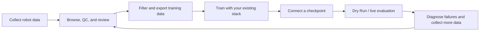

<div align="center">
  
  <h1>Embodit</h1>
  <p><strong>From real-robot data to model deployment, then back to the next data iteration.</strong></p>
  <p><strong>English</strong> · <a href="README.zh-CN.md">中文</a></p>
  <p>
    <a href="docs/data/README.md">Data guide</a> ·
    <a href="docs/deployment/README.md">Robot deployment guide</a> ·
    <a href="docs/architecture.md">Architecture</a>
  </p>
</div>

## Why Embodit

Real-robot model iteration is a recurring engineering loop, not one inference call:



Dataset inspection, quality decisions, training-set preparation, SSH, model services, tunnels, ROS bring-up, robot lifecycle operations, and action clients usually live in separate scripts and terminals. Embodit consolidates them into one local workspace and a reproducible configuration model.

Embodit does not replace your data-collection SDK, training framework, robot driver, or hardware safety system.

## Capabilities

| Layer | Capabilities |
|---|---|
| Data | Browse LeRobot v2.1/v3, RoboMimic HDF5, and MCAP; synchronized playback; automatic QC; review; labels; filtering; conversion; merge; augmentation; fidelity-aware export |
| Robot deployment | Reusable robot/model configs; OpenPI, LeRobot, and StarVLA checkpoints; custom Python models; SSH/systemd; model tunnel; ROS readiness; Dry Run; Live; monitoring, stop, and rollback |

See the [data guide](docs/data/README.md) and [robot deployment guide](docs/deployment/README.md). The current deployment architecture has been exercised on real hardware; each device still requires its own SDK integration, topics/actions, physical limits, and safety operations.

## Quick Start

### 1. Install and start

Requirements: Linux, Python 3.10+, [uv](https://docs.astral.sh/uv/), and Git.

```bash
git clone https://github.com/eddyLfan/Embodit.git
cd Embodit

# This directory becomes the data browsing root.
bash embodit.sh start /path/to/datasets
```

The first start installs all dependencies synchronously and opens the UI only after the environment is ready. Nothing continues installing in the background. You can also prepare the environment separately:

```bash
bash embodit.sh status
bash embodit.sh setup
```

An environment fingerprint derived from `pyproject.toml + uv.lock` skips synchronization on later starts when dependencies have not changed. The terminal prints a URL such as `http://localhost:8765/?token=...`; the first visit exchanges the Token for an HttpOnly Cookie.

Select a faster trusted PyPI mirror when the default route is slow:

```bash
EMBODIT_PYPI_MIRROR=tsinghua \
bash embodit.sh start /path/to/datasets

# Any trusted PEP 503 Simple Index is accepted.
EMBODIT_PYPI_MIRROR=https://your-mirror.example/simple \
bash embodit.sh setup
```

The script also respects uv's native `UV_DEFAULT_INDEX`, the shared uv cache, and `EMBODY_PROXY`. Package versions and hashes remain pinned by `uv.lock`.

Omit the path to use the current directory:

```bash
bash embodit.sh start
```

Service commands:

```bash
bash embodit.sh status
bash embodit.sh setup
bash embodit.sh logs 100
bash embodit.sh logs -f
bash embodit.sh restart /path/to/datasets
bash embodit.sh stop
```

Use another port when needed:

```bash
EMBODY_PORT=8877 bash embodit.sh start /path/to/datasets
```

### 2. LAN access

```bash
EMBODY_HOST=0.0.0.0 \
EMBODY_PUBLIC_HOST=<workstation-ip> \
bash embodit.sh start /path/to/datasets
```

Non-loopback listeners automatically enable path confinement: browsing and all writes are restricted to the selected data root. Set `EMBODIT_SANDBOX=0` only when a trusted deployment explicitly needs other paths.

### 3. Run a data iteration

1. Open a dataset and inspect cameras, state, action, and task text together.
2. Run automatic QC and review `quarantine` and `review` episodes.
3. Add episode/range labels and set final `pass/review/quarantine` decisions.
4. Export selected episodes, or run conversion, strict merge, and augmentation.

See the [data guide](docs/data/README.md) for formats, QC thresholds, and conversion mappings.

### 4. Connect a model and robot

Initialize the model source you need; skip this for a custom Python provider:

```bash
GIT_LFS_SKIP_SMUDGE=1 git submodule update --init --recursive
```

Copy the robot and model templates:

```bash
mkdir -p config/local/models
cp config/deployment/robot.example.json config/local/my-robot.json
cp config/deployment/models/python.example.json config/local/models/my-model.json
```

The committed templates deliberately use non-routable documentation addresses and `/path/to/...` placeholders. They validate the configuration shape but must not be run unchanged.

Replace the example hosts, SSH auth, ROS setup, bring-up, readiness, lifecycle operations, model environment, checkpoint, observation mapping, action dimensions, and safety limits with device-specific values. Never use example limits unchanged on hardware.

Compose and validate:

```bash
export ROBOT_SSH_PASSWORD='<robot-password>'

bash embodit.sh recipe-compose \
  config/local/my-robot.json \
  config/local/models/my-model.json \
  --output /tmp/my-deployment.json

bash embodit.sh recipe-validate /tmp/my-deployment.json
```

The recommended path is the “Robot deployment” workspace: select both configs, run the read-only preflight, then start the model and robot link. Equivalent CLI commands are:

```bash
bash embodit.sh recipe-run /tmp/my-deployment.json --mode dry_run
bash embodit.sh recipe-run /tmp/my-deployment.json --mode live
bash embodit.sh recipe-stop /tmp/my-deployment.json
bash embodit.sh recipe-stop /tmp/my-deployment.json --emergency
```

See the [robot deployment guide](docs/deployment/README.md) for the complete integration procedure and field reference.

## TODO

The project roadmap will be added here.

## Contributing

Issues, features, robot/model adapters, documentation, and fixes are welcome. See the [architecture guide](docs/architecture.md) for extension points.

## License

[MIT](LICENSE)
