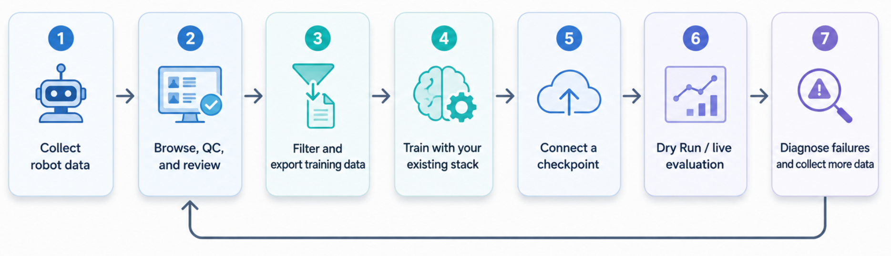

<div align="center">
  
  <h1>Embodit</h1>
  <p><strong>A local-first workspace for embodied-data curation and robot-model deployment.</strong></p>
  <p><strong>English</strong> · <a href="README.zh-CN.md">中文</a></p>
  <p>
    <a href="docs/data/README.md">Data guide</a> ·
    <a href="docs/deployment/README.md">Deployment guide</a> ·
    <a href="CONTRIBUTING.md">Contributing</a> ·
    <a href="SECURITY.md">Security</a>
  </p>
</div>

> [!IMPORTANT]
> Embodit is a pre-1.0 engineering toolkit. The data workspace is intended for
> reproducible local processing; robot deployment remains experimental and is
> not a real-time controller or hardware safety system. Back up important data,
> validate every device-specific limit, and keep a physical emergency stop
> within reach during live experiments.

## Overview

Real-world robot development is a loop: inspect collected data, find quality
problems, prepare the next training set, load a model, validate its inputs and
actions, run a controlled evaluation, and feed the result back into data
curation. These steps often live in unrelated scripts and terminals. Embodit
brings them into one local service and one reproducible configuration model.



Embodit does **not** replace a collection SDK, training framework, robot driver,
access-control gateway, or independent hardware safety chain.

## Capabilities

| Area | Included |
|---|---|
| Dataset inspection | LeRobot v2.1/v3, recognized RoboMimic/Astribot-style HDF5, and MCAP; timeline-aligned cameras, task text, state, and action series |
| Data governance | `pass/review/quarantine` decisions, episode/interval labels, configurable reasons, automatic QC, finding review, CSV reports |
| Data processing | Native subset export, fidelity-aware conversion, and strict same-format merge |
| Model integration | Custom Python models, OpenPI, LeRobot, StarVLA, or an existing compatible service; model weights are not bundled |
| Robot deployment | Composable Robot/Model Configs, Recipe v2, SSH/systemd orchestration, restricted model tunnel, ROS readiness, Dry Run, offline single-frame evaluation, Live mode, monitoring, rollback, and emergency software stop |

### Supported dataset formats

| Format | Browse / applicable QC | Native subset | Cross-format conversion | Strict merge |
|---|:---:|:---:|:---:|:---:|
| LeRobot v2.1 | ✓ | ✓ | ✓ | ✓ |
| LeRobot v3 | ✓ | ✓ | ✓ | ✓ |
| HDF5 (`.h5`, `.hdf5`) | ✓ | ✓ | ✓ | ✓ |
| MCAP file or directory | ✓ | ✓ | ✓ | ✓ |

Native subsets preserve the source format. Cross-format conversion may rebuild
metadata, transcode media, synthesize timestamps, or omit source-specific
topics; every conversion writes a report describing known losses. See the
[data fidelity notes](docs/data/README.md#5-subset-export-and-fidelity).

## Requirements

Core workspace:

- Linux with Bash;
- Python 3.10 or newer (`python3` on `PATH`);
- [uv](https://docs.astral.sh/uv/);
- a modern desktop browser;
- Git for cloning and optional model submodules.

Robot deployment additionally requires a usable systemd manager on each target.
Remote targets require OpenSSH access; a robot colocated with Embodit may run
directly as a local target. ROS, CUDA, provider-specific Python environments,
checkpoints, and vendor SDKs are optional components that must be installed
separately for the workflows that use them.

Embodit is an application repository (`tool.uv.package = false`), not a PyPI
library. Use `embodit.sh` as the supported service and deployment entry point.

## Quick start

```bash
git clone https://github.com/eddyLfan/Embodit.git
cd Embodit

# DATA_ROOT is the initial directory shown by the local workspace.
bash embodit.sh start /path/to/datasets
```

The first start synchronizes the locked **core** environment before launching
the service. Later starts skip synchronization while `pyproject.toml` and
`uv.lock` are unchanged. The terminal prints a URL such as
`http://localhost:8765/?token=...`; the first request exchanges the token for a
30-day HttpOnly cookie and redirects to a URL without the token.

Prepare dependencies without starting the service:

```bash
bash embodit.sh setup
```

Use a trusted package mirror when needed:

```bash
EMBODIT_PYPI_MIRROR=tsinghua bash embodit.sh setup

# Or any trusted PEP 503 Simple Index.
EMBODIT_PYPI_MIRROR=https://mirror.example/simple bash embodit.sh setup
```

`uv.lock` continues to pin package versions and hashes. Native uv index
configuration and `EMBODY_PROXY` are also supported.

### Service commands

```bash
bash embodit.sh status
bash embodit.sh logs 100
bash embodit.sh logs -f
bash embodit.sh restart /path/to/datasets
bash embodit.sh stop

# Stop the service before a real cleanup.
bash embodit.sh clean --expired --dry-run
bash embodit.sh clean --expired
bash embodit.sh clean --cache
bash embodit.sh clean --all
```

Cleanup only targets Embodit-managed cache paths. It does not delete dataset
outputs, labels, review files, deployment state, the virtual environment, or
the service token/log.

### Common environment variables

| Variable | Default | Purpose |
|---|---|---|
| `EMBODY_ROOT` | current directory | Initial data root when `start` has no path argument |
| `EMBODY_HOST` | `127.0.0.1` | Bind address |
| `EMBODY_PORT` | `8765` | Web port |
| `EMBODY_PUBLIC_HOST` | `localhost` | Host printed in the browser URL |
| `EMBODY_TOKEN` | generated/persisted | Explicit bearer token |
| `EMBODY_PROXY` | unset | HTTP(S) proxy for environment setup |
| `EMBODIT_SANDBOX` | automatic for non-loopback | Restrict client-supplied data paths to `DATA_ROOT` |
| `EMBODIT_STATE_DIR` | `.embodit/` | PID, URL, token, environment stamp, and service log |
| `EMBODIT_CACHE_DIR` | `.embodit_cache/` | Media cache, jobs, QC reports, and deployment state |
| `EMBODIT_REVIEW_CONFIG` | `config/data/review.json` | Review-reason configuration |

The full data-specific environment reference is in the
[data guide](docs/data/README.md#1-start-and-path-scope).

## Data workflow

1. Start Embodit with a directory that contains the datasets and intended
   output locations.
2. Inspect episode metadata, cameras, task text, and state/action signals.
3. Run automatic QC, then review findings and final episode decisions.
4. Save review progress to `*.review.json`; labels use the dataset's fixed
   sidecar (`labels.jsonl` for directory datasets or
   `<filename>.labels.jsonl` for file datasets).
5. Export selected episodes, convert formats, or strictly merge compatible
   datasets into a new output path.

QC, conversion, and merge run in detached workers. Closing the
browser does not stop them. Details, fidelity limits, thresholds, and cleanup
policy are documented in the [data guide](docs/data/README.md).

## Model and robot workflow

Initialize the provider source you plan to use; skip this for a standalone
custom Python provider or an existing external model service. For example:

```bash
GIT_LFS_SKIP_SMUDGE=1 git submodule update --init --recursive third_party/models/lerobot
git submodule status --recursive
```

Copy both component templates into the non-recursive discovery directory:

```bash
mkdir -p config/local
chmod 700 config/local
cp config/deployment/robot.example.json config/local/my-robot.json
cp config/deployment/models/python.example.json config/local/my-model.json
chmod 600 config/local/my-robot.json config/local/my-model.json
```

Committed templates contain documentation-only network addresses and
`/path/to/...` placeholders. Replace every host, SSH setting, ROS interface,
work directory, checkpoint, observation mapping, action dimension, lifecycle
operation, and physical limit. Never run a template unchanged on hardware.

Compose and validate a Recipe:

```bash
export ROBOT_SSH_PASSWORD='<robot-password>'

bash embodit.sh recipe-compose \
  config/local/my-robot.json \
  config/local/my-model.json \
  --output /tmp/my-deployment.json

bash embodit.sh recipe-validate /tmp/my-deployment.json
bash embodit.sh recipe-run /tmp/my-deployment.json --mode dry_run
```

`recipe-run --mode live` can send real actions. It requires an interactive
terminal, always starts in Dry Run, and requires the server-issued one-time
phrase within 60 seconds before promotion to Live. Use it only after read-only
preflight, model preparation, action-shape/limit verification, and an independent
hardware safety rehearsal. The complete procedure is in the
[deployment guide](docs/deployment/README.md).

## Security and privacy

- The service has no built-in TLS or multi-user RBAC. Keep it on localhost or a
  trusted private network. Never expose its HTTP port directly to the public
  Internet; use an authenticated TLS reverse proxy or an SSH tunnel when remote
  access is necessary.
- On localhost, `DATA_ROOT` is an initial browser location, not a security
  boundary. Non-loopback listeners automatically enable path confinement unless
  explicitly overridden.
- Anyone holding the bearer token can use data and deployment APIs. Protect
  `.embodit/token`, rotate `EMBODY_TOKEN` after suspected disclosure, and treat
  `.embodit/`, `.embodit_cache/`, logs, reports, and Recipes as sensitive.
- The core workspace contains no analytics or automatic cloud upload. During
  deployment, observations, images, state, and prompts are sent to the selected
  model host through the configured connection.
- Recipes, custom Python adapters/providers, checkpoints, submodules, datasets,
  and native media parsers must be treated as trusted inputs and run with least
  privilege.

Read [SECURITY.md](SECURITY.md) before LAN access or robot deployment.

## Documentation

| Document | Scope |
|---|---|
| [Data guide](docs/data/README.md) | Formats, review, labels, QC, conversion, merge, jobs, and cleanup |
| [Deployment guide](docs/deployment/README.md) | Robot/Model Config fields, Recipe lifecycle, safety, offline evaluation, Dry Run, and Live |
| [Third-party components](third_party/README.md) | Pinned model-provider integrations, ownership, and license boundaries |
| [Contributing](CONTRIBUTING.md) | Development setup, checks, and pull-request expectations |
| [Security policy](SECURITY.md) | Supported versions, reporting, threat model, and robot safety |
| [Changelog](CHANGELOG.md) | Release-level changes |

## Development

See [CONTRIBUTING.md](CONTRIBUTING.md) for development setup, module boundaries,
the complete validation matrix, and pull-request expectations.

## License and third-party software

Embodit-owned source is licensed under the [MIT License](LICENSE). Git
submodules, model weights, checkpoints, datasets, FFmpeg builds, and other
third-party assets retain their own licenses and usage terms. Embodit does not
redistribute provider checkpoints. Review
[third_party/README.md](third_party/README.md) and the license attached to every
asset before use or redistribution.
