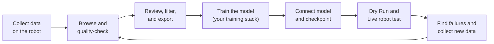
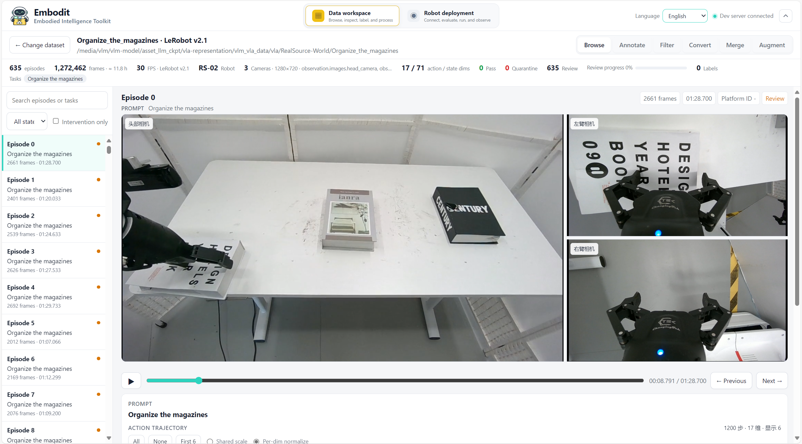
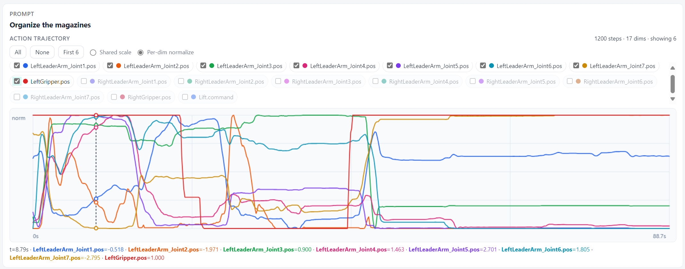
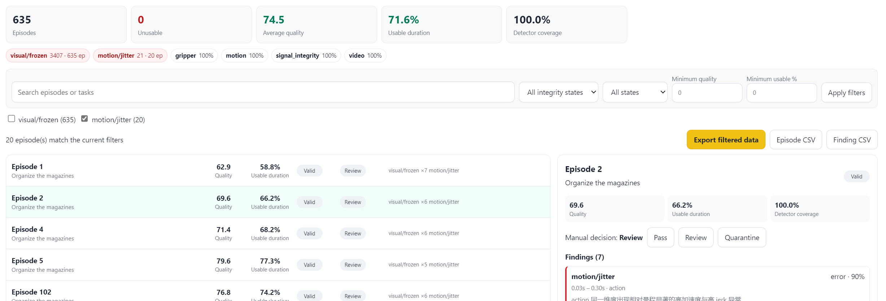
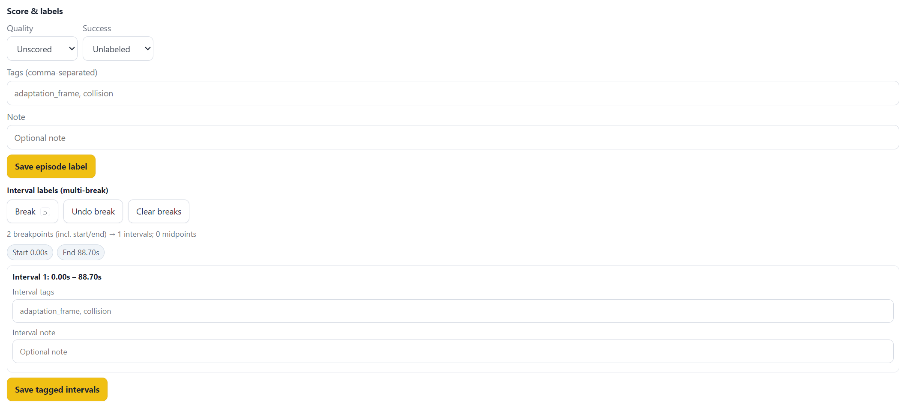
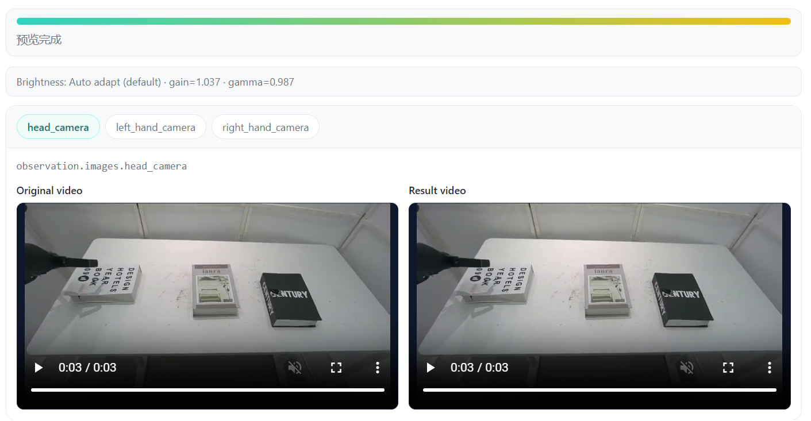
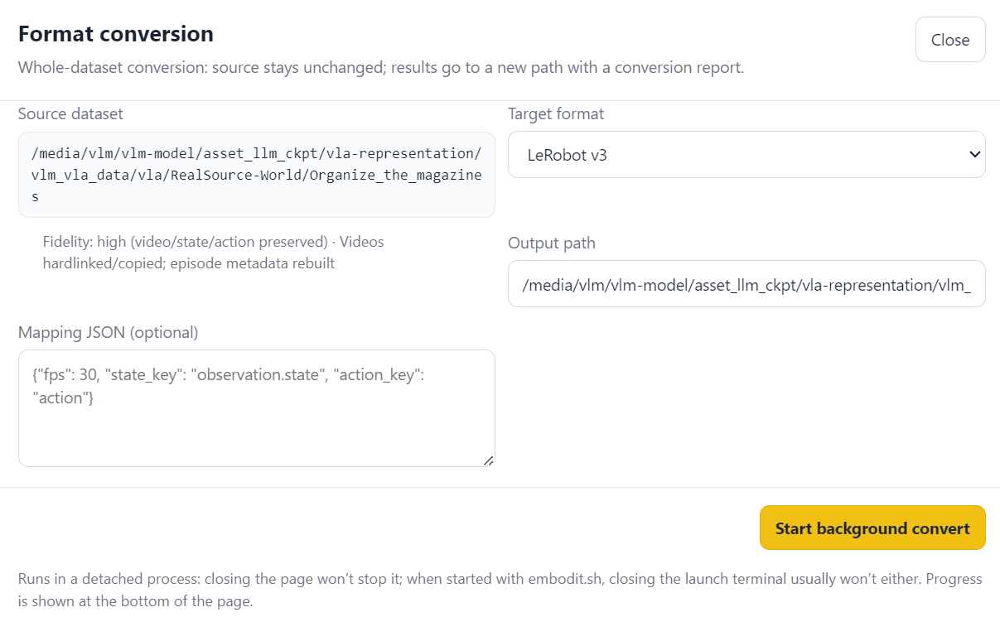
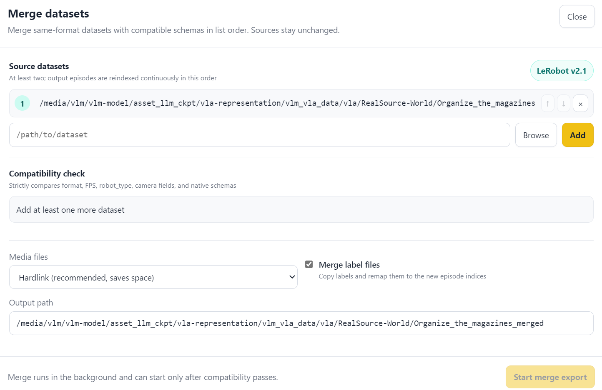

<div align="center">
  
  <h1>Embodit</h1>
  <p><strong>Close the loop from real-robot data to model deployment.</strong></p>
  <p>A local toolkit for embodied-AI dataset workflows and repeatable, safety-first robot testing.</p>
  <p><strong>English</strong> · <a href="README.zh-CN.md">中文</a></p>
  <p>
    <a href="docs/data/README.md">Data guide</a> ·
    <a href="docs/deployment/README.md">Deployment guide</a> ·
    <a href="docs/architecture.md">Architecture</a>
  </p>
  <p>
    
    
    
    <a href="LICENSE"></a>
  </p>
</div>

## Why we built Embodit

The hardest part of real-robot model development is often not a single algorithm. It is repeatedly completing the whole engineering loop:



In practice, this loop is fragmented. Data inspection has its own scripts; quality decisions live in personal experience; training inputs are prepared manually; and every robot test begins with many SSH sessions, process commands, tunnels, ROS checks, power-on steps, and client launches. Small changes to the robot SDK or network often make the process unstable again.

Embodit was built to turn that repeated work into one inspectable workflow. It helps teams move from collected data to a trustworthy training subset, accept the resulting checkpoint with a minimal Python interface, and reproduce the same robot deployment and test procedure on the next iteration.

> Embodit connects the loop around model training. It does not replace your data-collection SDK, training framework, or hardware safety system.

## What Embodit does in the loop

| Stage | What Embodit provides | Result |
|---|---|---|
| Data collection handoff | Open LeRobot v2.1/v3, RoboMimic HDF5, and MCAP; inspect episodes, cameras, state, and action together | Quickly verify what the robot actually recorded |
| Quality control | Deterministic integrity, video, motion, and gripper checks with interval evidence and human review | Auditable `pass` / `review` / `quarantine` decisions |
| Training-set preparation | Filter, label, merge, augment, convert, and export with explicit fidelity reports | A reproducible dataset for your training pipeline |
| Model handoff | Load a user Python entrypoint and checkpoint; generate the internal inference service automatically | No custom `/health` or `/infer` server for the normal path |
| Real-robot test | Manage dual-host SSH, tunnel, ROS bring-up, readiness, power, initial pose, and Robot Client | Repeatable one-click Dry Run instead of terminal choreography |
| Safe iteration | Explicit Live confirmation, local action limits, watchdog, logs, stop, and reverse rollback | Failures become evidence for the next data iteration |

### Two layers, one workflow

| Layer | Key capabilities | Detailed guide |
|---|---|---|
| **Data layer** | Synchronized playback, automatic QC, review, labels, filtering, conversion, strict merge, visual augmentation, fidelity-aware export | [Read the data guide →](docs/data/README.md) |
| **Real-robot deployment layer** | Recipe v2, managed model loading, SSH tunnel, ROS readiness, lifecycle operations, initial pose, Dry Run, Live, monitoring and rollback | [Read the deployment guide →](docs/deployment/README.md) |

Automatic QC is rule-based and configuration-versioned. Its hard-invalid conditions, visual/motion thresholds, scoring formula, selection rules, and manual overrides are documented—not hidden behind an opaque score. Robot startup is also readiness-driven: Embodit checks actual model health, tunnel health, ROS graph/types/rates/freshness, measured initial pose, and the first complete inference instead of waiting for fixed delays.

For the standard model path, users provide a remote Python `entrypoint` and checkpoint. The model class only needs `load(checkpoint)` and `predict(observations)`; Embodit owns the private transport, health checks, serialization, process supervision, and robot-side connection.

## Interface preview

### Inspect what the robot recorded

<p align="center">
  
</p>

<p align="center"><em>Browse episodes and replay synchronized multi-camera observations.</em></p>

<p align="center">
  
</p>

<p align="center"><em>Inspect prompts and normalized action trajectories dimension by dimension.</em></p>

### Turn quality findings into a training subset

<p align="center">
  
</p>

<p align="center"><em>Filter by measured quality, usable duration, integrity, and issue evidence; then review decisions before export.</em></p>

<table>
  <tr>
    <td width="50%"></td>
    <td width="50%"></td>
  </tr>
  <tr>
    <td align="center"><strong>Episode and interval labels</strong><br>Record task outcome, quality, tags, notes, and precise ranges.</td>
    <td align="center"><strong>Preview-gated augmentation</strong><br>Compare source and result videos before batch output.</td>
  </tr>
  <tr>
    <td width="50%"></td>
    <td width="50%"></td>
  </tr>
  <tr>
    <td align="center"><strong>Fidelity-aware conversion</strong><br>See what is preserved or rebuilt before starting a background job.</td>
    <td align="center"><strong>Strict dataset merge</strong><br>Check format, FPS, robot, camera fields, and native schemas first.</td>
  </tr>
</table>

The real-robot deployment workspace is still under active development, so its screenshot is intentionally omitted until the interface and workflow stabilize. Its Recipe v2 design, current behavior, configuration, and safety boundary are documented in the [deployment guide](docs/deployment/README.md).

## Quick start

Requirements: Linux, Python 3.10+, and [uv](https://docs.astral.sh/uv/).

```bash
git clone https://github.com/eddyLfan/Embodit.git
cd Embodit

# Start the local data workspace.
bash embodit.sh start /path/to/datasets
```

The terminal prints a local URL with a temporary access token. Omitting the dataset path uses the current directory.

```bash
# Service management
bash embodit.sh status
bash embodit.sh logs -f
bash embodit.sh stop

# Validate and start a real-robot Dry Run
bash embodit.sh recipe-validate config/deployment.recipe-v2.example.json
bash embodit.sh recipe-run config/deployment.recipe-v2.example.json --mode dry_run
```

For LAN access:

```bash
EMBODY_HOST=0.0.0.0 EMBODY_PUBLIC_HOST=<workstation-ip> \
  bash embodit.sh start /path/to/datasets
```

Next steps:

1. Follow the [data guide](docs/data/README.md) to scan, review, and export a training subset.
2. Train with your existing framework and produce a checkpoint.
3. Implement the minimal model adapter and configure Recipe v2 using the [deployment guide](docs/deployment/README.md).
4. Complete Dry Run before explicitly enabling Live operation.

## Changelog

### 2026-08-04

- Consolidated real-robot deployment on Recipe v2 and removed legacy deployment paths.
- Added an Embodit-managed Python model provider and standard ROS2 Robot Client.
- Completed model, SSH tunnel, ROS, initial-pose, Client monitoring, and reverse rollback orchestration.
- Added strict same-format dataset merge and fidelity-aware conversion/export behavior.
- Documented exact QC filtering, scoring, deployment readiness, and action-safety standards in English and Chinese.
- Reorganized the project and documentation around the data-to-robot iteration loop.

### 2026-08-03

- Added automatic QC, interval evidence, human review filtering, and augmentation previews.
- Added unified browsing and conversion for LeRobot, RoboMimic HDF5, and MCAP.

## Development and contributing

Contributions of all sizes are welcome. If you would like to participate long term and join the contributor team, open an Issue or contact the maintainer with a short introduction to your interests and intended area of contribution.

See the [architecture guide](docs/architecture.md) for module boundaries and extension points:

- new dataset format: implement and register the common interface in `backend/datasets/`;
- new QC rule: add a versioned detector under `backend/qc/detectors/` with stable issue codes and evidence;
- new conversion or augmentation: preserve capability checks, preview, and fidelity reporting;
- new model: implement `load(checkpoint)` and `predict(observations)` for the Python provider;
- new robot SDK: prefer a thin ROS Bridge exposing typed topics, services, and actions.

Before submitting changes:

```bash
UV_CACHE_DIR=/tmp/embodit-uv-cache uv run pytest -q
python3 -m compileall -q backend
bash -n embodit.sh
git diff --check
```

Keep implementation, tests, and documentation in the same change. Features capable of issuing physical actions must preserve Dry Run, explicit Live confirmation, local limits, watchdog behavior, hold/stop operations, and failure rollback.

## License

[MIT](LICENSE)
