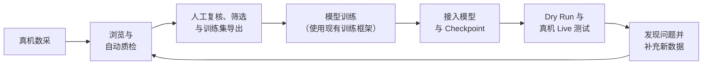

<div align="center">
  
  <h1>Embodit</h1>
  <p><strong>打通从真机数据到模型部署的完整循环。</strong></p>
  <p>面向具身智能数据处理与可复现、安全优先真机测试的本地工具。</p>
  <p><a href="README.md">English</a> · <strong>中文</strong></p>
  <p>
    <a href="docs/data/README.zh-CN.md">数据层指南</a> ·
    <a href="docs/deployment/README.zh-CN.md">真机部署指南</a> ·
    <a href="docs/architecture.md">项目架构</a>
  </p>
  <p>
    
    
    
    <a href="LICENSE"></a>
  </p>
</div>

## 我们为什么制作这个工具

真机模型开发最困难的往往不是某一个算法，而是反复跑通整条工程链路：



现实中，这条链路通常是割裂的：数据浏览依赖一套临时脚本，质量判断依赖个人经验，训练输入需要人工整理；每次真机测试又要打开多个 SSH 终端，依次启动模型、隧道、ROS、本体和客户端。机器人 SDK、网络或节点稍有变化，流程就可能再次失效。

Embodit 的开发动机，就是把这些高频但容易出错的工作沉淀成一个可以检查、复用和自动执行的闭环：从真机采集结果中得到可信训练数据，让训练完成的 Checkpoint 以最小接口接入，再稳定复现同一套真机部署与测试流程，并将失败样本重新带回下一轮数据迭代。

> Embodit 负责连接模型训练前后的工程链路，不替代本体数采 SDK、模型训练框架或硬件安全系统。

## Embodit 如何帮助这条循环链路

| 环节 | Embodit 提供的能力 | 得到的结果 |
|---|---|---|
| 数采结果接入 | 打开 LeRobot v2.1/v3、RoboMimic HDF5、MCAP，同步查看 Episode、相机、state 和 action | 快速确认本体究竟采到了什么 |
| 数据质检 | 确定性的完整性、视频、运动和夹爪检测，提供时间区间证据与人工复核 | 可审计的 `pass` / `review` / `quarantine` 判定 |
| 训练集准备 | 筛选、标注、合并、增强、转换和带保真报告的导出 | 可复现地交给现有训练流水线 |
| 模型接入 | OpenPI、LeRobot、StarVLA 只给 Checkpoint 即用；同时支持自定义 Python 入口 | 普通用户不再编写 `/health`、`/infer` 服务 |
| 真机部署测试 | 管理 Embodit 同机/独立模型端、本体 SSH、隧道、ROS Bringup、readiness、上电、初始位姿和 Robot Client | 用可复现的一键 Dry Run 代替多终端手工操作 |
| 安全迭代 | Live 显式确认、本体端动作限位、watchdog、日志、停止与逆序回滚 | 将真机失败转化为下一轮数据依据 |

### 两个功能层，一条完整工作流

| 功能层 | 核心能力 | 详细文档 |
|---|---|---|
| **数据层** | 同步回放、自动质检、人工复核、标签、筛选、转换、严格合并、视觉增强和保真导出 | [阅读数据层指南 →](docs/data/README.zh-CN.md) |
| **真机部署层** | 本体/模型配置分离与自由组合、本机/SSH 模型托管、Recipe、SSH 隧道、ROS readiness、本体生命周期、Dry Run、Live、监控与回滚 | [阅读真机部署指南 →](docs/deployment/README.zh-CN.md) |

自动质检是确定性、配置带版本的规则系统。Hard-invalid 条件、视觉/运动阈值、评分公式、筛选规则和人工覆盖关系都可以查看和修改，而不是隐藏在一个黑盒分数中。真机启动同样由 readiness 驱动：工具检查真实的模型 health、隧道 health、ROS graph/type/rate/freshness、实测初始位姿和首次完整推理，不使用固定等待时间假设组件已经启动。

OpenPI、LeRobot、StarVLA 在固定子仓库和独立环境一次性准备完成后，只需选择 Provider 并给定 Checkpoint；自定义模型仍可提供 Python `entrypoint`，实现 `load(checkpoint)`、`predict(observations)`。内部传输、健康检查、序列化、进程托管和本体侧连接由 Embodit 处理。

## 工具页面展示

### 查看本体实际采集到的内容

<p align="center">
  
</p>

<p align="center"><em>浏览 Episode，同步回放本体多相机观测。</em></p>

<p align="center">
  
</p>

<p align="center"><em>结合任务 Prompt，逐维查看归一化 Action 轨迹。</em></p>

### 将质量问题转化为可信训练集

<p align="center">
  
</p>

<p align="center"><em>按质量分、可用时长、完整性和问题证据筛选，人工确认后再导出。</em></p>

<table>
  <tr>
    <td width="50%"></td>
    <td width="50%"></td>
  </tr>
  <tr>
    <td align="center"><strong>Episode 与区间标注</strong><br>记录任务结果、质量、标签、备注和精确时间段。</td>
    <td align="center"><strong>预览确认后增强</strong><br>批量写出前先比较原始视频和处理结果。</td>
  </tr>
  <tr>
    <td width="50%"></td>
    <td width="50%"></td>
  </tr>
  <tr>
    <td align="center"><strong>带保真说明的格式转换</strong><br>后台任务开始前明确哪些内容会保留或重建。</td>
    <td align="center"><strong>严格数据集合并</strong><br>先检查格式、FPS、本体、相机字段和原生 Schema。</td>
  </tr>
</table>

真机部署工作台仍在持续开发，因此暂不放置界面截图，待页面与流程稳定后再补充。Recipe 的设计、当前实现、配置方式和安全边界见[真机部署指南](docs/deployment/README.zh-CN.md)。

## Quick start

要求：Linux、Python 3.10+、[uv](https://docs.astral.sh/uv/)。

```bash
git clone https://github.com/eddyLfan/Embodit.git
cd Embodit

# 启动本地数据工作台
bash embodit.sh start /path/to/datasets
```

终端会输出带临时访问 Token 的本地地址。不传数据路径时使用当前目录。

```bash
# 服务管理
bash embodit.sh status
bash embodit.sh logs -f
bash embodit.sh stop

# 组合本体/模型配置，校验并启动 Dry Run
bash embodit.sh recipe-compose config/deployment/robot.example.json config/deployment/models/python.example.json --output /tmp/deployment.json
bash embodit.sh recipe-validate /tmp/deployment.json
bash embodit.sh recipe-run /tmp/deployment.json --mode dry_run
```

局域网访问：

```bash
EMBODY_HOST=0.0.0.0 EMBODY_PUBLIC_HOST=<工作电脑IP> \
  bash embodit.sh start /path/to/datasets
```

推荐的下一步：

1. 按照[数据层指南](docs/data/README.zh-CN.md)完成扫描、复核和训练集导出。
2. 使用现有训练框架训练并得到 Checkpoint。
3. 选择 OpenPI、LeRobot、StarVLA 的 Checkpoint 即用 Provider，或实现自定义 Python 适配器；根据[真机部署指南](docs/deployment/README.zh-CN.md)分别配置本体与模型并组合测试。
4. 完成 Dry Run 后，再显式确认进入 Live。

## 更新日志

### 2026-08-04

- 将真机配置拆为可独立保存、自由组合的本体 Config 与模型 Config，运行时统一生成 Recipe。
- 真机部署层收敛到 Recipe，并删除旧部署路径。
- 增加 Embodit 托管的 Python Model Provider 和标准 ROS2 Robot Client。
- 增加固定版本的 OpenPI、LeRobot、StarVLA 子仓库、Checkpoint 即用适配器与模型配置模板。
- 完成模型、SSH 隧道、ROS、初始位姿和 Client 的编排、监控与逆序回滚。
- 增加严格同格式数据集合并，以及带保真结论的转换与导出。
- 以中英文明确记录质检筛选、评分、部署 readiness 和动作安全标准。
- 围绕“数据到真机”的迭代闭环重新组织项目和文档。

### 2026-08-03

- 增加自动质检、时间区间证据、人工复核筛选和增强预览。
- 增加 LeRobot、RoboMimic HDF5、MCAP 的统一浏览与转换。

## 二次开发、共建说明

欢迎任何形式的功能完善、问题修复和文档贡献。如果希望长期参与项目并加入 Contributor 团队，欢迎通过 Issue 或直接联系项目维护者提出申请，并简要介绍感兴趣的方向与计划参与的内容。

项目模块边界和扩展点见[开发架构说明](docs/architecture.md)：

- 新数据格式：在 `backend/datasets/` 实现并注册统一接口；
- 新质检规则：在 `backend/qc/detectors/` 增加带版本的 Detector，保持 issue code 和证据稳定；
- 新转换或增强：保留能力检查、预览和保真报告；
- 新模型族：增加固定上游版本、许可证/引用记录、Checkpoint 适配器、配置模板和测试；自定义模型可为 Python Provider 实现 `load(checkpoint)` 和 `predict(observations)`；
- 新机器人 SDK：优先实现暴露带类型 topic、service、action 的薄 ROS Bridge。

提交修改前执行：

```bash
UV_CACHE_DIR=/tmp/embodit-uv-cache uv run pytest -q
python3 -m compileall -q backend
bash -n embodit.sh
git diff --check
```

请将功能、测试和文档放在同一变更中。涉及真实动作的功能必须保留 Dry Run、显式 Live 确认、本体端限位、watchdog、hold/stop 和失败回滚。

## License

[MIT](LICENSE)
