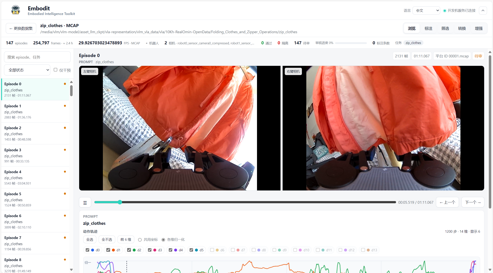
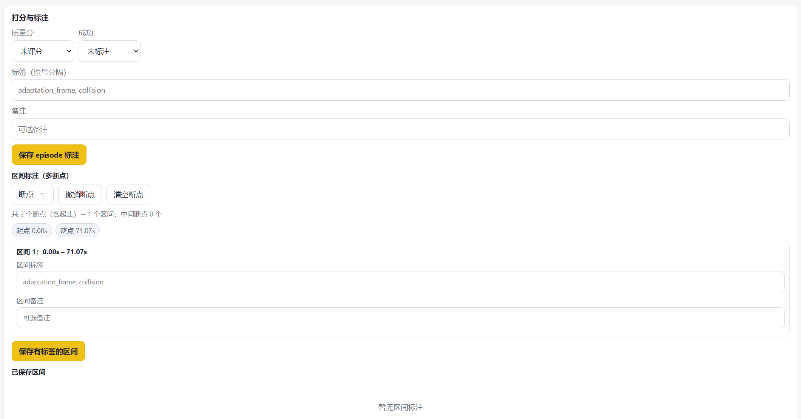
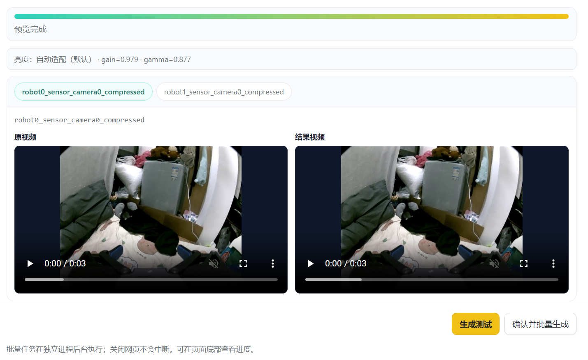

<h1 align="center">Embodit</h1>

<p align="center">
  
</p>

<p align="center">
  <b>Embodied Intelligence Toolkit</b><br />
  面向机器人与 VLA 数据集的本地可视化工作台
</p>

<p align="center">
  <a href="#支持格式"></a>
  <a href="#快速开始"></a>
  <a href="#快速开始"></a>
  <a href="LICENSE"></a>
</p>

<p align="center">
  <a href="README.md">English</a> | <b>中文</b>
</p>

Embodit 在浏览器中直接打开本地机器人数据集，提供 episode 浏览、人工质检、标注、筛选、格式转换、导出和视觉增强。数据默认留在本机，无需上传到第三方服务。

> 原始样本内容保持只读。审阅与标注写入旁路文件；导出、转换和增强结果写入新目录。

## 核心能力

| 模块 | 能力 |
|---|---|
| **浏览** | 自动识别数据格式；多相机同步预览；按 episode 或任务检索 |
| **质检与标注** | 质量评分、成功/失败、标签、备注和区间标注（快捷键 `B`） |
| **筛选** | `pass` / `review` / `quarantine` 决策、批量操作和按状态导出 |
| **转换与导出** | 四种格式互转；同格式子集导出；后台任务与保真报告 |
| **视觉增强** | 自动/手动亮度；基于 SAM3 的物体换色和背景替换；预览确认后批量写出 |

自动筛选接口已预留，规则引擎尚未开放。

## 效果展示

### 数据集概览

在统一工作台中查看数据集信息、episode 列表、多相机画面以及状态与动作轨迹。

<p align="center">
  
</p>

<table>
  <tr>
    <td width="50%"></td>
    <td width="50%"></td>
  </tr>
  <tr>
    <td align="center"><b>质检与标注</b><br />记录评分、标签、备注和区间标注</td>
    <td align="center"><b>数据增强</b><br />对比原始与增强结果，确认后批量写出</td>
  </tr>
</table>

## 快速开始

### 环境要求

- Python 3.10 或更高版本
- [uv](https://docs.astral.sh/uv/getting-started/installation/)

```bash
# 安装 uv（如尚未安装）
curl -LsSf https://astral.sh/uv/install.sh | sh

git clone https://github.com/eddyLfan/Embodit.git
cd Embodit
```

### 启动服务

```bash
bash start.sh /path/to/your/data
```

首次启动会根据 `pyproject.toml` 和 `uv.lock` 创建 `.venv` 并安装依赖。服务就绪后，终端会输出访问地址：

```text
http://localhost:8765/?token=<random>
```

首次访问会将令牌换成 HttpOnly Cookie，之后可直接打开 `http://localhost:8765/`。

```bash
bash stop.sh          # 停止服务
tail -f service.log   # 查看日志
bash start.sh --help  # 查看启动参数
```

## 使用流程

1. 指定数据路径，由 Embodit 自动识别格式和 episode。
2. 同步查看相机、状态与动作，记录评分、标签和备注。
3. 将 episode 标记为 `pass`、`review` 或 `quarantine`。
4. 按筛选结果导出子集，或转换为目标格式。
5. 可选：预览视觉增强效果，确认后批量写入新数据集。

## 支持格式

| 格式 | 支持的典型布局 |
|---|---|
| **LeRobot v2.1** | parquet、视频与元数据目录 |
| **LeRobot v3** | LeRobot v3 目录数据集 |
| **HDF5** | RoboMimic 风格 `.hdf5` / `.h5` 单文件或目录 |
| **MCAP** | 单文件、顶层多文件或一层分片目录 |

转换能力矩阵（行：源格式；列：目标格式）：

| → | LeRobot v2.1 | LeRobot v3 | HDF5 | MCAP |
|---|:---:|:---:|:---:|:---:|
| **LeRobot v2.1** | full | high | partial | partial |
| **LeRobot v3** | high | full | partial | partial |
| **HDF5** | partial | partial | full | partial |
| **MCAP** | partial | partial | partial | full |

- `full`：同格式无损子集导出
- `high`：保留主体数据，可能调整布局或元数据
- `partial`：可能损失字段、标定或格式专属元数据

具体损失会显示在界面中，并写入 `conversion_report.json`。字段和 topic 映射示例见 [`config/convert.example.json`](config/convert.example.json)。

## 配置

### 环境变量

| 变量 | 说明 | 默认值 |
|---|---|---|
| `EMBODY_ROOT` | 数据浏览根目录 | 启动参数或当前目录 |
| `EMBODY_HOST` | 服务监听地址 | `127.0.0.1` |
| `EMBODY_PORT` | 服务端口 | `8765` |
| `EMBODY_PUBLIC_HOST` | 终端输出 URL 使用的主机名 | `localhost` |
| `EMBODY_TOKEN` | 访问令牌 | `config/token` 或随机生成 |
| `EMBODY_PROXY` | `uv` 下载使用的 HTTP(S) 代理 | 空 |
| `EMBODIT_SANDBOX` | 将可访问路径限制在浏览根目录内 | 关闭；设为 `1` 开启 |
| `EMBODIT_HDF5_FPS` | HDF5 缺少帧率时的回退值 | `20` |
| `EMBODIT_MCAP_GAP_S` | MCAP 按时间间隙切分 episode 的阈值（秒） | `2` |
| `AUGMENT_PYTHON` | SAM3 worker 使用的 Python | 当前解释器 |
| `AUGMENT_SAM3_CHECKPOINT` | SAM3 checkpoint 路径 | `checkpoints/sam3.pt` |

兼容旧环境变量：`LEROBOT_*` 与对应的 `EMBODY_*` 等价。

### 局域网访问

服务默认仅监听本机。如需局域网访问，请设置固定强令牌，并通过防火墙或反向代理限制来源：

```bash
EMBODY_HOST=0.0.0.0 \
EMBODY_PUBLIC_HOST=<server-ip> \
EMBODY_TOKEN=<strong-random-token> \
bash start.sh /path/to/your/data
```

## 数据增强

亮度、掩码换色和背景替换算法已内置。亮度增强可直接使用；颜色增强还需要 Meta SAM3、兼容的 PyTorch/CUDA 环境以及已获授权的 checkpoint。

```bash
# 在独立 Python 3.12 环境中按显卡/CUDA 版本安装 PyTorch，然后：
git clone https://github.com/facebookresearch/sam3.git ../sam3
python -m pip install -r config/augment-worker-requirements.txt
python -m pip install -e ../sam3

export AUGMENT_PYTHON=/path/to/sam3-env/bin/python
export AUGMENT_SAM3_CHECKPOINT=/path/to/sam3.pt
bash start.sh /path/to/your/data
```

SAM3 的环境要求和 checkpoint 获取方式以 [`facebookresearch/sam3`](https://github.com/facebookresearch/sam3) 为准；许可证说明见 [`third_party/README.md`](third_party/README.md)。未配置 SAM3 时，颜色增强会被禁用并显示缺失项，不影响其他功能。

批量增强必须关联一次成功预览。预览后修改亮度、prompt、颜色、应用方式或 GPU，必须重新生成预览。

### 增强输出保真度

增强结果输出为 LeRobot v2.1 或 v3，保留：

- 相机视频
- `observation.state`（如存在）
- `action`（如存在）
- episode 任务信息

自定义表格字段、标定、源统计和格式专属元数据不会复制；视频会重新编码为 H.264。因此增强输出的保真等级为 `partial`，详情记录在 `meta/augmentation_report.json`。

## 数据写入与安全

Embodit 不修改原始 episode payload，但会在源路径旁写入审阅和标注旁路文件：

```text
<source>/
  <name>.review.json      # 目录数据集的人工筛选结果
  labels.jsonl            # 评分与标注

  # 单文件 HDF5 / MCAP：
  <file>.review.json
  <file>.labels.jsonl
```

导出、转换和增强必须写入源数据集之外的新路径：

```text
<output>/
  selection_manifest.json
  conversion_report.json          # 转换保真与已知损失
  meta/augmentation_report.json   # 增强保真与已知损失
```

输出路径不得等于或位于源数据集内部。

## 开发与测试

```bash
uv sync --extra dev
uv run pytest -q

uv run python backend/app.py \
  --host 127.0.0.1 \
  --port 8765 \
  --browse-root /path/to/data \
  --token dev-token
```

## 项目结构

```text
.
├── backend/
│   ├── app.py          # FastAPI 入口
│   ├── datasets/       # 格式探测、适配器、帧读取与导出
│   ├── labels/         # 标注 schema 与存储
│   ├── convert/        # 格式转换和后台任务
│   ├── augment/        # 内置视觉增强与 SAM3 适配
│   └── qc/             # 自动筛选预留
├── web/                # 浏览器 UI 与中英文文案
├── tests/              # 自动化测试
├── config/             # 示例配置和 worker 依赖
├── checkpoints/        # 可选 SAM3 权重（不纳入 Git）
├── start.sh / stop.sh  # 服务启停
├── pyproject.toml
└── uv.lock
```

## 版本与贡献

当前版本：**v0.1.0**。

欢迎提交 Issue 和 Pull Request。请提供涉及的数据格式、复现步骤和预期行为。

## 许可证

Embodit 采用 [MIT License](LICENSE)。SAM3 等第三方组件适用各自许可证。
