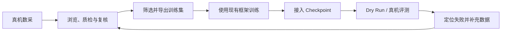

<div align="center">
  
  <h1>Embodit</h1>
  <p><strong>从真机数据到模型部署，再回到下一轮数据。</strong></p>
  <p><a href="README.md">English</a> · <strong>中文</strong></p>
  <p>
    <a href="docs/data/README.zh-CN.md">数据层指南</a> ·
    <a href="docs/deployment/README.zh-CN.md">真机部署指南</a> ·
    <a href="docs/architecture.md">开发架构</a>
  </p>
</div>

## 为什么做 Embodit

真机模型迭代不是一次推理调用，而是一条需要反复运行的工程链路：



数据查看、质量判断、训练集整理、SSH、模型服务、隧道、ROS Bringup、本体生命周期和动作客户端通常分散在不同脚本与终端中。Embodit 将这些步骤收敛为一个本地工作台和一套可复现配置，让同一条链路能够被检查、复用和停止。

Embodit 不替代数采 SDK、训练框架、机器人驱动或硬件安全系统。

## 功能

| 层 | 能力 |
|---|---|
| 数据 | LeRobot v2.1/v3、RoboMimic HDF5、MCAP 浏览；同步回放；自动 QC；人工复核；标签；筛选；转换；合并；增强；保真导出 |
| 真机部署 | 本体/模型配置复用；OpenPI、LeRobot、StarVLA Checkpoint；自定义 Python 模型；SSH/systemd；模型隧道；ROS readiness；Dry Run；Live；监控、停止与回滚 |

数据层用法见[数据层指南](docs/data/README.zh-CN.md)，模型和本体接入见[真机部署指南](docs/deployment/README.zh-CN.md)。当前部署架构已完成真机链路验证；具体本体的 SDK、topic/action、物理限位和安全操作仍需按设备填写。

## Quick Start

### 1. 安装并启动

要求：Linux、Python 3.10+、[uv](https://docs.astral.sh/uv/) 和 Git。

```bash
git clone https://github.com/eddyLfan/Embodit.git
cd Embodit

# 启动工作台；该目录是允许浏览的数据根目录
bash embodit.sh start /path/to/datasets
```

首次启动会同步安装全部依赖，安装成功后再启动页面，不会在后台继续补装组件。也可以先单独准备环境：

```bash
bash embodit.sh status
bash embodit.sh setup
```

环境状态按 `pyproject.toml + uv.lock` 指纹缓存；依赖未变化时后续启动不再执行同步。终端输出形如 `http://localhost:8765/?token=...` 的地址；首次打开后 Token 会写入 HttpOnly Cookie 并从地址栏移除。

默认 PyPI 较慢时可使用清华镜像：

```bash
EMBODIT_PYPI_MIRROR=tsinghua \
bash embodit.sh start /path/to/datasets

# 也可以使用任意可信的 PEP 503 Simple Index
EMBODIT_PYPI_MIRROR=https://your-mirror.example/simple \
bash embodit.sh setup
```

脚本也尊重 uv 原生的 `UV_DEFAULT_INDEX`、全局缓存和 `EMBODY_PROXY`。镜像只是下载来源，版本和哈希仍由 `uv.lock` 固定。

不传数据目录时使用当前目录：

```bash
bash embodit.sh start
```

服务管理：

```bash
bash embodit.sh status
bash embodit.sh setup
bash embodit.sh logs 100
bash embodit.sh logs -f
bash embodit.sh restart /path/to/datasets
bash embodit.sh stop
```

端口被占用时：

```bash
EMBODY_PORT=8877 bash embodit.sh start /path/to/datasets
```

### 2. 局域网访问

```bash
EMBODY_HOST=0.0.0.0 \
EMBODY_PUBLIC_HOST=<工作电脑IP> \
bash embodit.sh start /path/to/datasets
```

非本地监听会自动启用路径保护，浏览、标签、导出、转换、合并和增强只能访问启动时给定的数据根目录。仅在可信环境且明确需要访问其他路径时才显式设置 `EMBODIT_SANDBOX=0`。

### 3. 完成一轮数据处理

1. 在“数据工作台”打开数据集并同步检查相机、state、action 和任务文本。
2. 运行自动 QC，复核 `quarantine` 和 `review` 项。
3. 添加 Episode 或时间区间标签，确定最终 `pass/review/quarantine`。
4. 导出选中的 Episode，或执行转换、严格合并和增强。

格式差异、QC 阈值和转换字段见[数据层指南](docs/data/README.zh-CN.md)。

### 4. 接入模型与本体

先初始化所需模型源码；只使用自定义 Python Provider 时可跳过：

```bash
GIT_LFS_SKIP_SMUDGE=1 git submodule update --init --recursive
```

复制并填写本体、模型配置：

```bash
mkdir -p config/local/models
cp config/deployment/robot.example.json config/local/my-robot.json
cp config/deployment/models/python.example.json config/local/models/my-model.json
```

仓库模板刻意使用不可路由的文档专用地址和 `/path/to/...` 占位路径，只用于展示和校验配置结构，不能原样运行。

将示例中的主机、SSH 认证、ROS setup、Bringup、readiness、生命周期操作、模型环境、Checkpoint、观测映射、动作维度和真实安全限位替换为设备值。不要直接使用示例限位控制真机。

组合并检查：

```bash
export ROBOT_SSH_PASSWORD='<robot-password>'

bash embodit.sh recipe-compose \
  config/local/my-robot.json \
  config/local/models/my-model.json \
  --output /tmp/my-deployment.json

bash embodit.sh recipe-validate /tmp/my-deployment.json
```

推荐启动工作台，在“真机部署”中选择两份配置，先运行只读预检，再启动模型和本体链路。CLI 等价入口：

```bash
bash embodit.sh recipe-run /tmp/my-deployment.json --mode dry_run
bash embodit.sh recipe-run /tmp/my-deployment.json --mode live
bash embodit.sh recipe-stop /tmp/my-deployment.json
bash embodit.sh recipe-stop /tmp/my-deployment.json --emergency
```

完整接入步骤和每个配置字段见[真机部署指南](docs/deployment/README.zh-CN.md)。

## TODO

后续计划将在此补充。

## 参与开发

欢迎提交 Issue、功能实现、机器人/模型适配、文档或问题修复。模块边界与扩展入口见[开发架构](docs/architecture.md)。

## License

[MIT](LICENSE)
